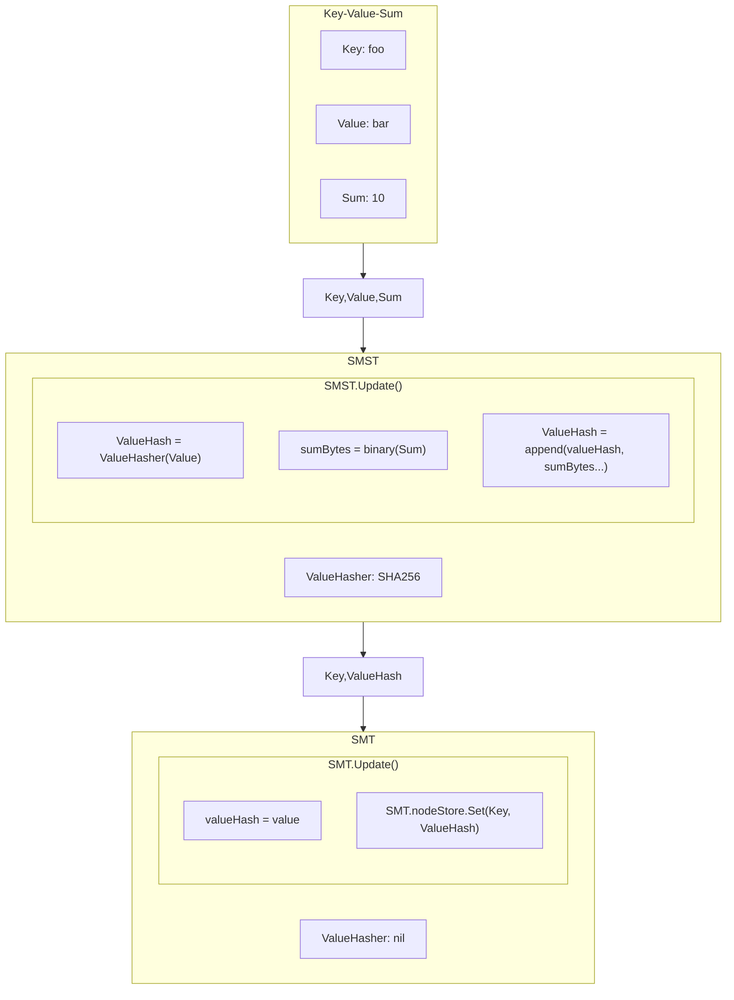
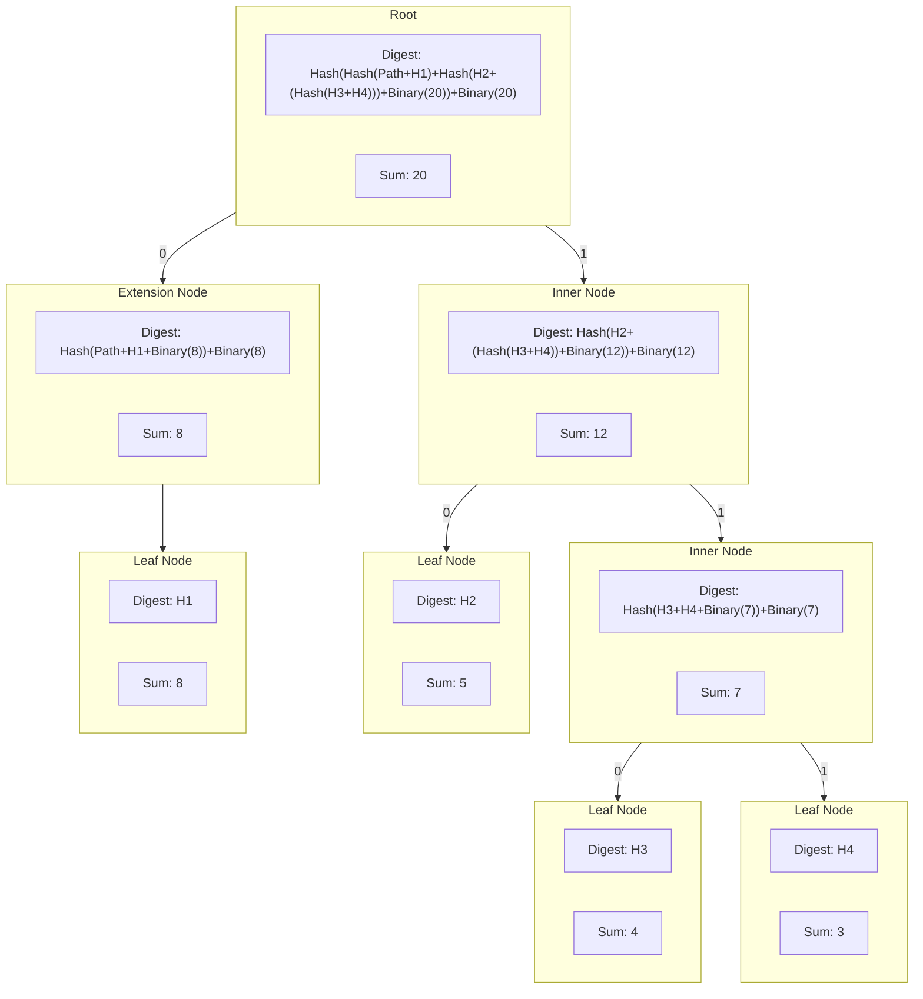
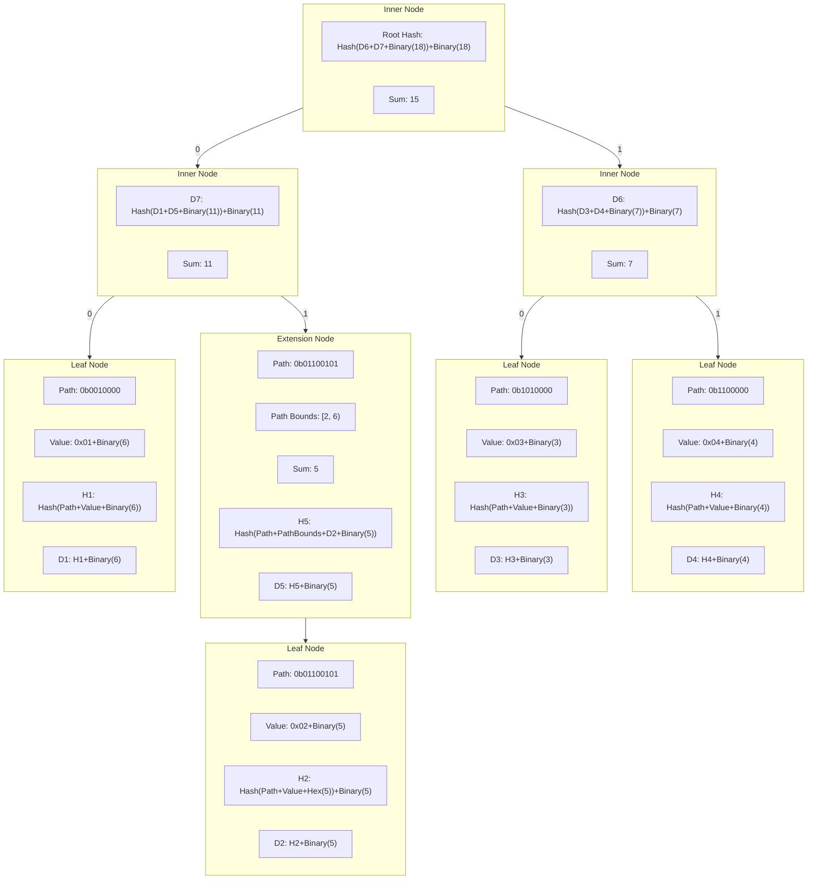

# Sparse Merkle Sum Tree (smst) <!-- omit in toc -->

- [Overview](#overview)
- [Implementation](#implementation)
  - [Sum Encoding](#sum-encoding)
  - [Digests](#digests)
  - [Visualisations](#visualisations)
    - [General Tree Structure](#general-tree-structure)
    - [Binary Sum Digests](#binary-sum-digests)
- [Sum](#sum)
- [Nil Values](#nil-values)
- [Example](#example)

## Overview

Merkle Sum trees function very similarly to regular Merkle trees, with the primary difference being that each leaf node in a Merkle sum tree includes a `sum` in addition to its value. This allows for the entire tree's total sum to be calculated easily, as the sum of any branch is the sum of its children. Thus the sum of the root node is the sum of the entire tree. Like a normal Merkle tree, the Merkle sum tree allows for the efficient verification of its members, proving non-membership / membership of certain elements and generally functions the same.

Merkle sum trees can be very useful for blockchain applications in that they can easily track accounts balances and, thus, the total balance of all accounts. They can be very useful in proof of reserve systems whereby one needs to prove the membership of an element that is a component of the total sum, along with a verifiable total sum of all elements.

## Implementation

The implementation of the Sparse Merkle Sum Tree (SMST) follows, in principle, the same implementation as the [Plasma Core Merkle Sum tree][plasma core docs]. The main differences with the current SMT implementation are outlined below. The primary difference lies in the encoding of node data within the tree to accommodate for the sum.

In practice the SMST is a wrapper around the SMT with a new field added to the `TreeSpec`: `sumTree bool` this determines whether the SMT should follow its regular encoding of that of the sum tree.

_Note_: The Plasma Core Merkle Sum tree uses a 16 byte hex string to encode the sum whereas this SMST implementation uses an 8 byte binary representation of the `uint64` sum.

The majority of the code relating to the SMST can be found in:

- [smst.go](./smst.go) - main SMT wrapper functionality
- [hasher.go](./hasher.go) - SMST encoding functions
- [types.go](./types.go) - SMST interfaces and node serialistion/hashing functions

### Sum Encoding

The sum for any node is encoded in a byte array with a fixed size (`[8]byte`) this allows for the sum to fully represent a `uint64` value in binary form. The golang `encoding/binary` package is used to encode the sum with `binary.BigEndian.PutUint64(sumBz[:], sum)` into a byte array `sumBz`.

In order for the SMST to include the sum into a leaf node the SMT the SMST initialises the SMT with the `WithValueHasher(nil)` option so that the SMT does **not** hash any values. The SMST will then hash the value and append the sum bytes to the end of the hashed value, using whatever `ValueHasher` was given to the SMST on initialisation.



### Digests

The digest for any node in the SMST is calculated in partially the same manner as the regular SMT. The main differences are that the sum is included in the digest `preimage` - meaning the hash of any node's data includes **BOTH** its data _and_ sum. In addition to this the sum is appended to the hash producing digests like so:

`digest = [node hash]+[8 byte sum]`

Therefore for the following node types, the digests are computed as follows:

- **Inner Nodes**
  - Prefix: `[]byte{1}`
  - `sumBytes = binary(leftChild.sum+rightChild.sum)`
  - `digest = hash([]byte{1} + leftChild.digest + rightChild.digest + sumBytes) + sumBytes`
- **Extension Nodes**
  - Prefix: `[]byte{2}`
  - `sumBytes = binary(child.sum)`
  - `digest = hash([]byte{2} + pathBounds + path + child.digest + sumBytes) + sumBytes`
- **Leaf Nodes**
  - Prefix: `[]byte{0}`
  - `sumBytes = binary(sum)`
  - `digest = hash([]byte{0} + path + valueHash) + sumBytes`
    - **Note**: as mentioned above the `valueHash` is already appended with the `sumBytes` prior to insertion in the underlying SMT
- **Lazy Nodes**
  - Prefix of the actual node type is stored in the persisted digest as determined above
  - `digest = persistedDigest`

This means that with a hasher such as `sha256.New()` whose hash size is `32 bytes`, the digest of any node will be `40 bytes` in length.

### Visualisations

The following diagrams are representations of how the tree and its components can be visualised.

#### General Tree Structure

None of the nodes have a different structure to the regular SMT, but the digests of nodes now include their sum as described above and the sum is included in the leaf node's value. For the purposes of visualization, the sum is included in all nodes as an extra field.



#### Binary Sum Digests

The following diagram shows the structure of the digests of the nodes within the tree in a simplified manner, again none of the nodes have a `sum` field, but for visualisation purposes the sum is included in all nodes with the exception of the leaf nodes where the sum is shown as part of its value.



## Sum

The `Sum()` function adds functionality to easily retrieve the tree's current sum as a `uint64`.

## Nil Values

A `nil` value and `0` weight is the same as the placeholder value and default sum in the SMST and as such inserting a key with a `nil` value has specific behaviours. Although the insertion of a key-value-weight grouping with a `nil` value and `0` weight will alter the root hash, a proof will not recognise the key as being in the tree.

Assume `(key, value, weight)` groupings as follows:

- `(key, nil, 0)` -> DOES modify the `root` hash
  - Proving this `key` is in the tree will fail
- `(key, nil, weight)` -> DOES modify the `root` hash
  - Proving this `key` is in the tree will succeed
- `(key, value, 0)` -> DOES modify the `root` hash
  - Proving this `key` is in the tree will succeed
- `(key, value, weight)` -> DOES modify the `root` hash
  - Proving this `key` is in the tree will succeed
- `(key, value, weight)` -> DOES modify the `root` hash
  - Proving this `key` is in the tree will succeed

## Example

```go
package main

import (
	"crypto/sha256"
	"fmt"

	"github.com/pokt-network/smt"
)

func main() {
	// Initialise a new key-value store to store the nodes of the tree
	// (Note: the tree only stores hashed values, not raw value data)
	nodeStore := smt.NewSimpleMap()

	// Initialise the tree
	tree := smt.NewSparseMerkleSumTree(nodeStore, sha256.New())

	// Update tree with keys, values and their sums
	_ = tree.Update([]byte("foo"), []byte("oof"), 10)
	_ = tree.Update([]byte("baz"), []byte("zab"), 7)
	_ = tree.Update([]byte("bin"), []byte("nib"), 3)

	sum := tree.Sum()
	fmt.Println(sum == 20) // true

	// Generate a Merkle proof for "foo"
	proof, _ := tree.Prove([]byte("foo"))
	root := tree.Root() // We also need the current tree root for the proof

	// Verify the Merkle proof for "foo"="oof" where "foo" has a sum of 10
	if valid := smt.VerifySumProof(proof, root, []byte("foo"), []byte("oof"), 10, tree.Spec()); valid {
		fmt.Println("Proof verification succeeded.")
	} else {
		fmt.Println("Proof verification failed.")
	}
}
```

[plasma core docs]: https://plasma-core.readthedocs.io/en/latest/specs/sum-tree.html
