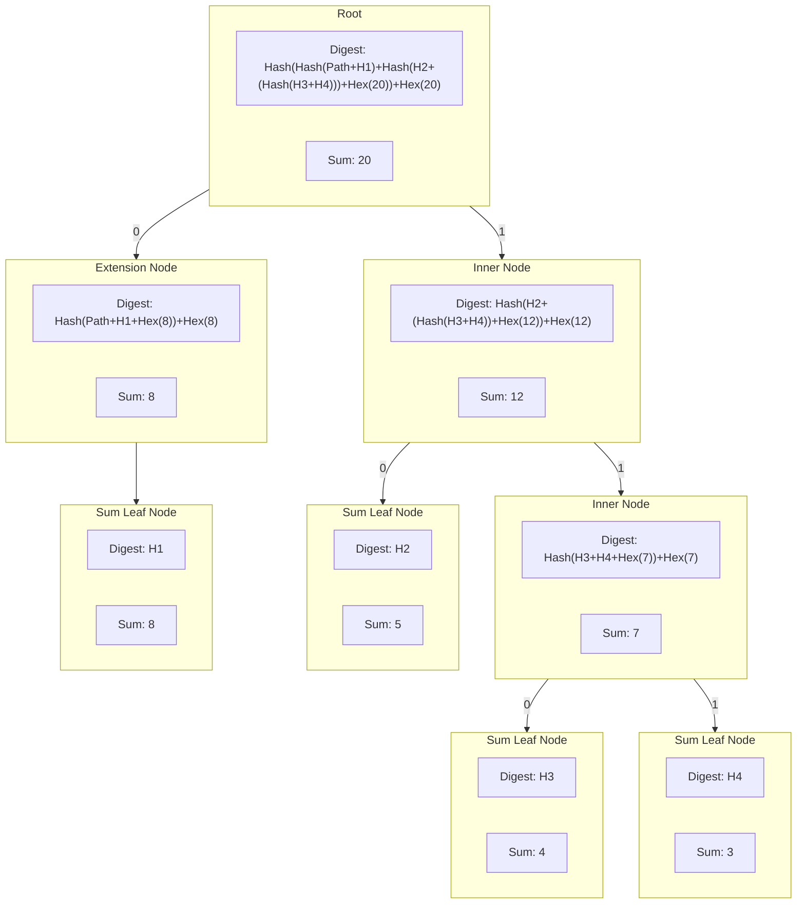
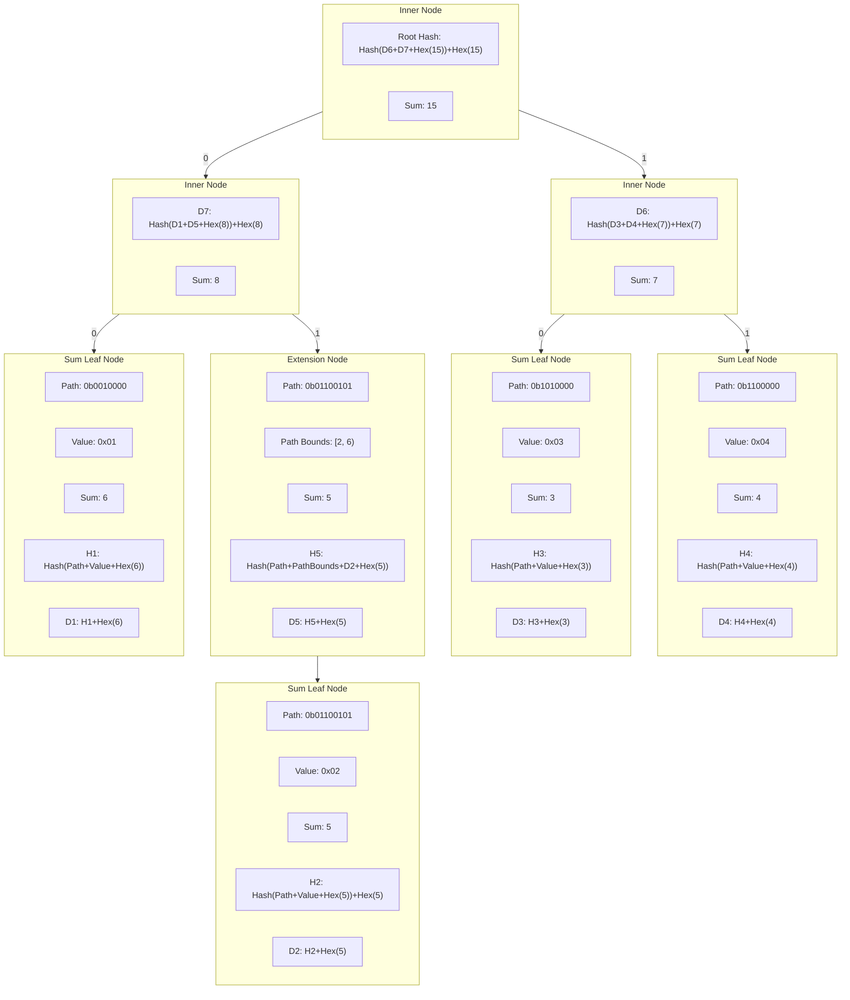

# Sparse Merkle Sum Tree (smst) <!-- omit in toc -->

- [Overview](#overview)
- [Implementation](#implementation)
  - [Hexadecimal Encoding](#hexadecimal-encoding)
  - [Digests](#digests)
  - [Sum Leaves](#sum-leaves)
  - [Visualisations](#visualisations)
    - [General Tree Structure](#general-tree-structure)
    - [Sum Hex Digests](#sum-hex-digests)
- [Sum](#sum)
- [Example](#example)

## Overview

Merkle Sum trees function very similarly to regular Merkle trees, with the primary difference being that each leaf node in a Merkle sum tree includes a `sum` in addition to its value. This allows for the entire tree's total sum to be calculated easily, as the sum of any branch is the sum of its children. Thus the sum of the root node is the sum of the entire tree. Like a normal Merkle tree, the Merkle sum tree allows for the efficient verification of its members, proving non-membership / membership of certain elements and generally functions the same.

Merkle sum trees can be very useful for blockchain applications in that they can easily track accounts balances and, thus, the total balance of all accounts. They can be very useful in proof of reserve systems whereby one needs to prove the membership of an element that is a component of the total sum, along with a verifiable total sum of all elements.

## Implementation

The implementation of the Sparse Merkle Sum Tree (SMST) follows, in principle, the same implementation as the [Plasma Core Merkle Sum tree][plasma core docs]. The main differences with the current SMT implementation are outlined below. The primary difference lies in the encoding of node data within the tree to accommodate for the sum.

### Hexadecimal Encoding

The sum for any node is encoded in a hexadecimal byte array with a fixed size (`[8]byte`) this allows for the sum to fully represent a `uint64` value in hexadecimal form. The golang `encoding/hex` package is used to encode the result of `fmt.Sprintf("%016x", uint64(sum))` into a byte array.

### Digests

The digest for any node in the SMST is calculated in partially the same manner as the regular SMT. The main differences are that the sum is included in the digest `preimage` - meaning the hash of any node's data includes **BOTH** its sum, and digest like so:

`digest = [node digest]+[8 byte hex sum]`

Therefore for the following node types, the digests are computed as follows:

- **Inner Nodes**
  - Prefix:`[]byte{1}`
  - `digest = hash([]byte{1} + leftChild.digest + rightChild.digest + hex(leftChild.sum+rightChild.sum)) + [8 byte hex sum]`
- **Extension Nodes**
  - Prefix: `[]byte{2}`
  - `digest = hash([]byte{2} + pathBounds + path + child.digest + hex(child.sum)) + [8 byte hex sum]`
- **Sum Leaf Nodes**
  - Prefix: `[]byte{0}`
  - `digest = hash([]byte{0} + path + value + hexSum) + [8 byte hex sum]`
- **Lazy Nodes**
  - Prefix of the actual node type is stored in the digest
  - `digest = persistedDigest`

This means that with a hasher such as `sha256.New()` whose hash size is `32 bytes`, the digest of any node will be `40 bytes` in length.

### Sum Leaves

The SMST introduces a new node type, the `sumLeafNode`, which is almost identical to a `leafNode` from the SMT. However, it includes a `sum` field which is an `[8]byte` hexadecimal representation of the `uint64` sum of the node.

  In an SMST, the `sumLeafNode` replaces the `leafNode` type.

### Visualisations

The following diagrams are representations of how the tree and its components can be visualised.

#### General Tree Structure

The only nodes that hold a separate sum value are the `sumLeafNode` nodes, while all other nodes store their sum as part of their digest. For the purposes of visualization, the sum is included in all nodes.



#### Sum Hex Digests

The following diagram shows the structure of the digests of the nodes within the tree in a simplified manner, again only the `sumLeafNode` objects have a `sum` field but for visualisation purposes the sum is included in all nodes.



## Sum

The `Sum()` function adds functionality to easily retrieve the tree's current sum as a `uint64`.

## Example

```go
package main

import (
	"crypto/sha256"
	"fmt"

	"github.com/pokt-network/smt"
)

func main() {
	// Initialise a new key-value store to store the nodes of the tree
	// (Note: the tree only stores hashed values, not raw value data)
	nodeStore := smt.NewSimpleMap()

	// Initialise the tree
	tree := smt.NewSparseMerkleSumTree(nodeStore, sha256.New())

	// Update tree with keys, values and their sums
	_ = tree.Update([]byte("foo"), []byte("oof"), 10)
	_ = tree.Update([]byte("baz"), []byte("zab"), 7)
	_ = tree.Update([]byte("bin"), []byte("nib"), 3)

	sum, _ := tree.Sum()
	fmt.Println(sum) // 20

	// Generate a Merkle proof for "foo"
	proof, _ := tree.Prove([]byte("foo"))
	root := tree.Root() // We also need the current tree root for the proof

	// Verify the Merkle proof for "foo"="oof" where "foo" has a sum of 10
	if valid, _ := smt.VerifySumProof(proof, root, []byte("foo"), []byte("oof"), 10, tree.Spec()); valid {
		fmt.Println("Proof verification succeeded.")
	} else {
		fmt.Println("Proof verification failed.")
	}
}

```

[plasma core docs]: https://plasma-core.readthedocs.io/en/latest/specs/sum-tree.html
