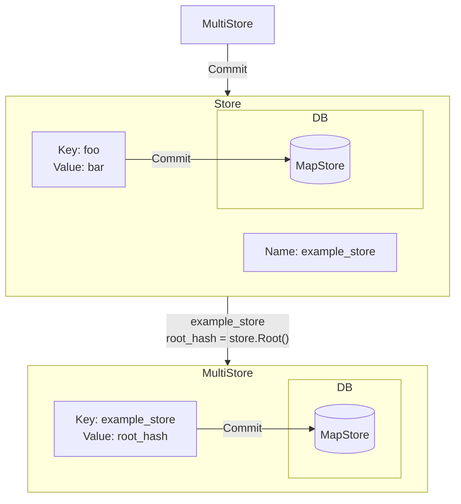

# MultiStore <!-- omit in toc -->

- [Overview](#overview)
- [Implementation](#implementation)
	- [MultiStore](#multistore)
	- [Store](#store)
- [MultiStore Operations](#multistore-operations)
	- [Store Creator Functions](#store-creator-functions)
- [MultiStore Tree Operations](#multistore-tree-operations)
	- [Commit](#commit)
	- [Root](#root)
	- [Prove](#prove)
- [Store Operations](#store-operations)

## Overview

The `MultiStore` is a wrapper around an SMT that keeps track of and manages numerous different `Store`s. The `MultiStore` contains the name and root hash of each store in its own SMT and allows for the addition of new stores, retrieval of stores, removal of stores and insertion of pre-existing stores. The `MultiStore` interface grants the easy management of numerous different SMTs.

## Implementation

The interface definitions of the `MultiStore` and `Store` wrappers for the SMT can be found in [`types.go`](./types.go)

```go
// MultiStore is a collection of SMTs managed by a single SMT, this allows for
// the creation and validation of any SMT managed by the MultiStore being
// included in the MultiStore as well using the stores individually
type MultiStore interface {
	// --- Store operations ---

	// AddStore adds a tree to the MultiStore
	AddStore(name string, creator func(string, MultiStore) (Store, MapStore)) error
	// InsertStore adds a pre-existing store into the MultiStore
	InsertStore(name string, store Store, db MapStore) error
	// GetStore returns a tree from the MultiStore
	GetStore(name string) (Store, error)
	// RemoveStore removes a tree from the MultiStore
	RemoveStore(name string) error
Sto
	// --- Tree operations ---

	// Commit commits all the trees in the MultiStore and the MultiStore itself
	Commit() error
	// Root returns the root hash of the MultiStore
	Root() []byte
}

// Store is a wrapper around an SMT for use within the MultiStore
type Store interface {
	SparseMerkleTree
	Commit() error
}
```

The implementations of both interfaces can be found in [`multi.go`](./multi.go)

### MultiStore

The `MultiStore` interface is implemented by the local `multi` struct. This keeps track of the following fields:

```go
type multi struct {
	nodeStore MapStore
	tree      *SMT
	storeMap  map[string]Store
	dbMap     map[string]MapStore
}
```

This is in essence an SMT as well as a map of the different SMTs the `MultiStore` tracks, one per name.

### Store

The `Store` interface is implemented by the local `store` struct. This keeps track of the following fields:

```go
type store struct {
	*SMT
	name      string
	nodeStore MapStore
	multi     *multi
}
```

This is essentially an embedded SMT which also keeps track of the `MultiStore` that it is a part of, as well as its name and underlying database.

## MultiStore Operations

The `MultiStore` interface allows for the following operations:

```go
// AddStore adds a tree to the MultiStore
AddStore(name string, creator func(string, MultiStore) (Store, MapStore)) error
// InsertStore adds a pre-existing store into the MultiStore
InsertStore(name string, store Store, db MapStore) error
// GetStore returns a tree from the MultiStore
GetStore(name string) (Store, error)
// RemoveStore removes a tree from the MultiStore
RemoveStore(name string) error
```

These methods enable:

1. The addition of new `Store`s via the provided creator function
2. The insertion of pre-existing `Store`s
3. The retrieval of `Store`s
4. The removal of `Store`s

### Store Creator Functions

The `Store` creator function enables the customisation of the stores that are added to the `MultiStore`. This enables the use of custom databases (that implement the `MapStore` interface) and custom Tree/Path/Value hashers for the SMT the `Store` wraps.

The creator function must satisfy the following signature:

```go
func creatorFunc(name string, multi MultiStore) (Store, MapStore)
```

Where the creator function returns both the wrapped SMT `Store` interface and also the underlying database for the `Store`.

## MultiStore Tree Operations

The `MultiStore` interface also exposes the following operations around its tree:

```go
// Commit commits all the trees in the MultiStore and the MultiStore itself
Commit() error
// Root returns the root hash of the MultiStore
Root() []byte
// Prove returns a SparseMerkleProof for the given key from the MultiStore tree
Prove(key []byte) (*SparseMerkleProof, error)
```

### Commit

The `Commit` method on the `MultiStore` calls the `Commit` method on the individual `Store`s that the `MultiStore` manages and then calls the `Commit` method of the SMT the `MultiStore` wraps.

The `Store` interface overrides the `Commit` method of the SMT to not only commit the changes from memory to its underlying database but also to update the `MultiStore` it tracks, with the root hash of the `Store` under the key `[]byte(store.name)`.



### Root

The `Root` method return the root hash of the tree that the `MultiStore` wraps, this includes the name and root hashes of each of the `Store`s that the `MultiStore` tracks.

### Prove

The `Prove` method generates a `SparseMerkleProof` for the given key from within the tree that the `MultiStore` wraps. This is used to check the inclusion/exclusion of a `Store` within the `MultiStore`, as these are the only values included in the `MultiStore` tree.

## Store Operations

The `Store` interface is a wrapper around an SMT that is managed by a `MultiStore`. The `Store` differes from the SMT it wraps solely in the `Commit` method. This, as mentioned above, is overwritten to not only commit the changes from memory to its underlying database but also to update the `MultiStore` it is tracked by, with the root hash of the `Store` under the key `[]byte(store.name)`.

Other wise all the regular SMT methods work the same with the `Store` interface as they do on a regular SMT.
