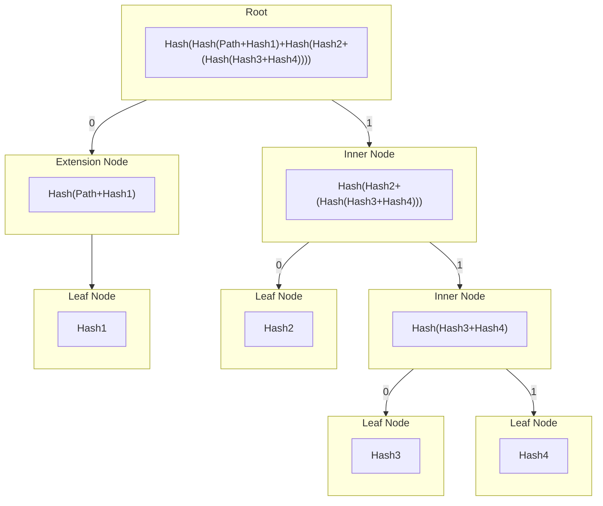
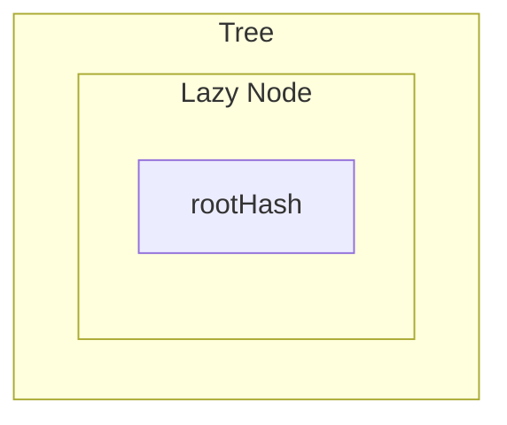
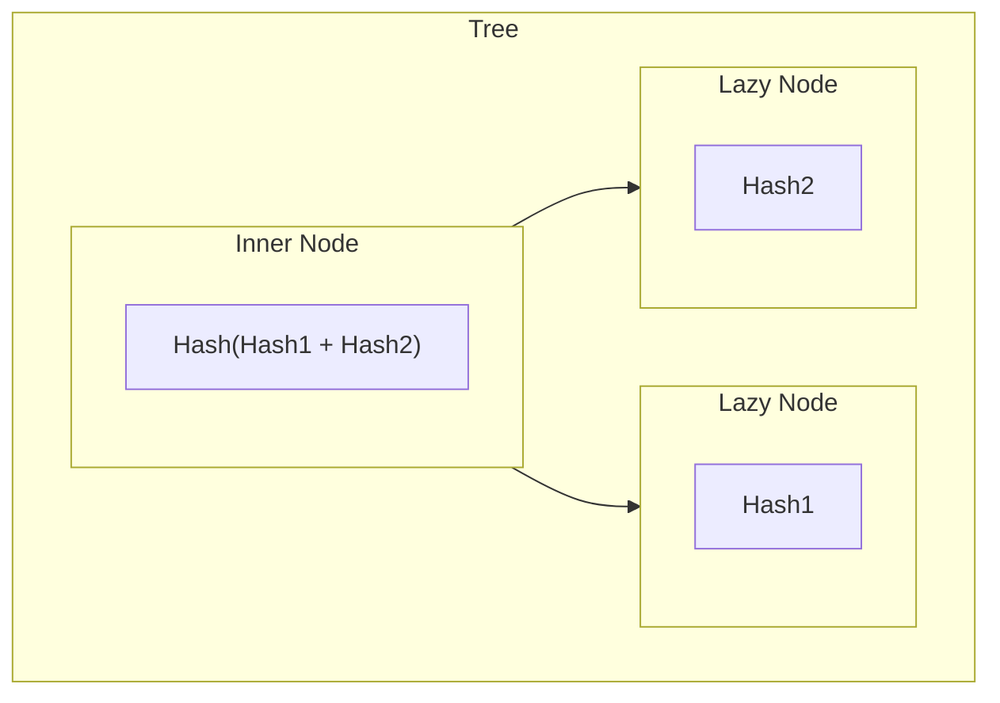
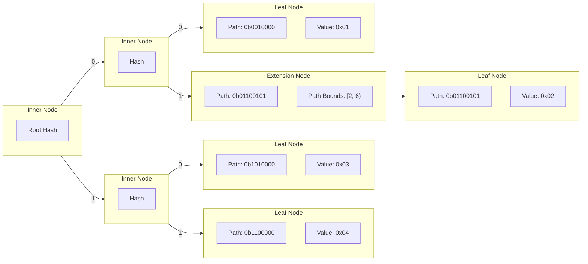
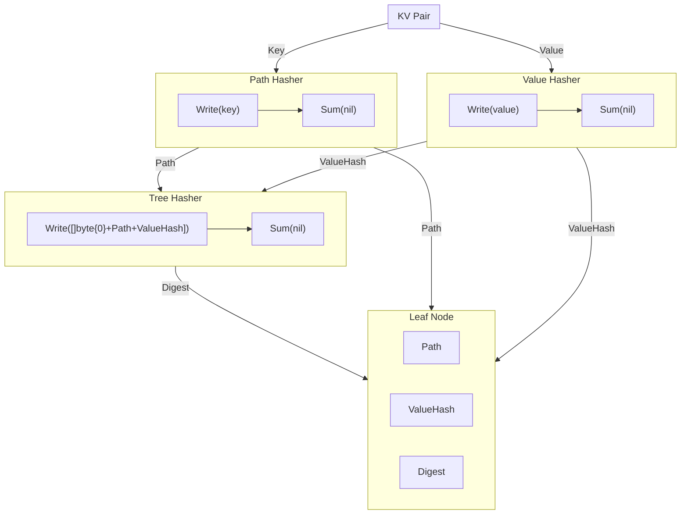

# smt <!-- omit in toc -->

[](https://img.shields.io/github/v/tag/pokt-network/smt.svg?sort=semver)
[](https://godoc.org/github.com/pokt-network/smt)
[](https://goreportcard.com/report/github.com/pokt-network/smt)
[](https://github.com/pokt-network/smt/actions/workflows/test.yml)
[](https://codecov.io/gh/pokt-network/smt)

Note: **Requires Go 1.18+**

- [Overview](#overview)
- [Implementation](#implementation)
	- [Inner Nodes](#inner-nodes)
	- [Extension Nodes](#extension-nodes)
	- [Leaf Nodes](#leaf-nodes)
	- [Lazy Nodes](#lazy-nodes)
	- [Lazy Loading](#lazy-loading)
	- [Visualisations](#visualisations)
		- [General Tree Structure](#general-tree-structure)
		- [Lazy Nodes](#lazy-nodes-1)
- [Paths](#paths)
	- [Visualisation](#visualisation)
- [Values](#values)
	- [Nil values](#nil-values)
- [Hashers \& Digests](#hashers--digests)
- [Proofs](#proofs)
	- [Verification](#verification)
- [Database](#database)
	- [Data Loss](#data-loss)
- [Sparse Merkle Sum Tree](#sparse-merkle-sum-tree)
- [Example](#example)

## Overview

This is a Go library that implements a Sparse Merkle tree for a key-value map. The tree implements the same optimisations specified in the [Libra whitepaper][libra whitepaper], to reduce the number of hash operations required per tree operation to O(k) where k is the number of non-empty elements in the tree.

Sparse Merkle Trees (SMTs) are efficient and secure data structures for storing key-value pairs. They use a hash-based tree structure to represent the data sparsely, saving memory. Cryptographic hash functions ensure data integrity and authenticity. SMTs enable users to prove the existence or non-existence of specific key-value pairs by constructing cryptographic proofs. These properties make SMTs valuable in applications like blockchains, decentralized databases, and authenticated data structures, providing optimized and trustworthy data storage and verification.

## Implementation

The SMT has 4 node types that are used to construct the tree:

- Inner Nodes
  - Prefixed `[]byte{1}`
  - `digest = hash([]byte{1} + leftChild.digest + rightChild.digest)`
- Extension Nodes
  - Prefixed `[]byte{2}`
  - `digest = hash([]byte{2} + pathBounds + path + child.digest)`
- Leaf Nodes
  - Prefixed `[]byte{0}`
  - `digest = hash([]byte{0} + path + value)`
- Lazy Nodes
  - Prefix of the actual node type is stored in the persisted digest as determined above
  - `digest = persistedDigest`

### Inner Nodes

Inner nodes represent a branch in the tree with two **non-nil** child nodes. The inner node has an internal `digest` which represents the hash of the child nodes concatenated hashes.

### Extension Nodes

Extension nodes represent a singly linked chain of inner nodes, with a single child. They are used to represent a common path in the tree and as such contain the path and bounds of the path they represent. The `digest` of an extension node is the hash of its path bounds, the path itself and the child nodes digest concatenated.

### Leaf Nodes

Leaf nodes store the full path which they represent and also the hash of the value they store. The `digest` of a leaf node is the hash of the leaf nodes path and value concatenated.

The SMT stores only the hashes of the values in the tree, not the raw values themselves. In order to store the raw values in the underlying database the option `WithValueHasher(nil)` must be passed into the `NewSparseMerkleTree` constructor.

### Lazy Nodes

Lazy nodes represent uncached, persisted nodes, and as such only store the `digest` of the node. When a lazy node is accessed the node type will be determined and the full node type will be populated with any relevant fields such as its children and path.

### Lazy Loading

This library uses a cached, lazy-loaded tree structure to optimize performance. It optimises performance by not reading from/writing to the underlying database on each operation, deferring any underlying changes until the `Commit()` function is called.

All nodes have a `persisted` field which signals whether they have been persisted to the underlying database or not. In practice this gives a large performance optimisation by working on cached data and not reading from/writing to the database on each operation. If a node is deleted from the tree it is marked as `orphaned` and will be deleted from the database when the `Commit()` function is called.

Once the `Commit()` function is called the tree will delete any orphaned nodes from the database and write the key-value pairs of all the unpersisted leaf nodes' hashes and their values to the database.

### Visualisations

The following diagrams are representations of how the tree and its components can be visualised.

#### General Tree Structure

The different nodes types described above make the tree have a structure similar to the following:



#### Lazy Nodes

When importing a tree via `ImportSparseMerkleTree` the tree will be lazily loaded from the root hash provided. As such the initial tree structure would contain just a single lazy node, until the tree is used and nodes have to be resolved from the database, whose digest is the root hash of the tree.



If we were to resolve just this root node, we could have the following tree structure:



Where `Hash(Hash1 + Hash2)` is the same root hash as the previous example.

## Paths

Paths are **only** stored in two types of nodes: Leaf nodes and Extension nodes.

- Extension nodes contain not only the path they represent but also the path bounds (ie. the start and end of the path they cover).
- Leaf nodes contain the full path which they represent, as well as the value stored at that path.

Inner nodes do **not** contain a path, as they represent a branch in the tree and not a path. As such their children, _if they are extension nodes or leaf nodes_, will hold a path value.

### Visualisation

The following diagram shows how paths are stored in the different nodes of the tree. In the actual SMT paths are not 8 bit binary strings but are instead the returned values of the `PathHasher` (discussed below). These are then used to calculate the path bit (`0` or `1`) at any index of the path byte slice.



## Values

By default the SMT will use the `hasher` passed into `NewSparseMerkleTree` to hash both the keys into their paths in the tree, as well as the values. This means the data stored in a leaf node will be the hash of the value, not the value itself.

However, if this is not desired, the two option functions `WithPathHasher` and `WithValueHasher` can be used to change the hashing function used for the keys and values respectively.

If `nil` is passed into `WithValueHasher` functions, it will act as identity hasher and store the values unaltered in the tree.

### Nil values

A `nil` value is the same as the placeholder value in the SMT and as such inserting a key with a `nil` value has specific behaviours. Although the insertion of a key-value pair with a `nil` value will alter the root hash, a proof will not recognise the key as being in the tree.

Assume `(key, value)` pairs as follows:

- `(key, nil)` -> DOES modify the `root` hash
  - Proving this `key` is in the tree will fail
- `(key, value)` -> DOES modify the `root` hash
  - Proving this `key` is in the tree will succeed

## Hashers & Digests

When creating a new SMT or importing one a `hasher` is provided, typically this would be `sha256.New()` but could be any hasher implementing the go `hash.Hash` interface. By default this hasher, referred to as the `TreeHasher` will be used on both keys (to create paths) and values (to store). But separate hashers can be passed in via the option functions mentioned above.

Whenever we do an operation on the tree, the `PathHasher` is used to hash the key and return its digest - the path. When we store a value in a leaf node we hash it using the `ValueHasher`. These digests are calculated by writing to the hasher and then calculating the checksum by calling `Sum(nil)`.

The digests of all nodes, regardless of the `PathHasher` and `ValueHasher`s being used, will be the result of writing to the `TreeHasher` and calculating the `Sum`. The exact data hashed will depend on the type of node, this is described in the [implementation](#implementation) section.

The following diagram represents the creation of a leaf node in an abstracted and simplified manner.

_Note_: This diagram is not entirely accurate regarding the process of creating a leaf node, but is a good representation of the process.



## Proofs

The `SparseMerkleProof` type contains the information required for membership and non-membership proofs, depending on the key provided to the tree method `Prove(key []byte)` either a membership or non-membership proof will be generated.

The `SparseMerkleProof` type contains the relevant information required to rebuild the root hash of the tree from the given key. This information is:

- Any side nodes
- Data of the sibling node
- Data for the unrelated leaf at the path
  - This is `nil` for membership proofs, and only used for non-membership proofs

`SparseMerkleProof`s can be compressed into `SparseCompactMerkleProof` objects, which are smaller and more efficient to store. These can be created by calling `CompactProof()` with a `SparseMerkleProof`.

### Verification

In order to verify a `SparseMerkleProof` the `VerifyProof` method is called with the proof, tree spec, root hash as well as the key and value (if a membership proof) that the proof is for.

The verification step simply uses the proof data to recompute the root hash with the data provided and the digests stored in the proof. If the root hash matches the one provided then the proof is valid, otherwise it is an invalid proof.

## Database

This library defines the `MapStore` interface, in [mapstore.go](./mapstore.go)

```go
type MapStore interface {
	Get(key []byte) ([]byte, error)
	Set(key []byte, value []byte) error
	Delete(key []byte) error
}
```

This interface abstracts the `SimpleMap` key-value store and can be used by the SMT to store the nodes of the tree. Any key-value store that implements the `MapStore` interface can be used with this library.

When changes are commited to the underlying database using `Commit()` the digests of the leaf nodes are stored at their respective paths. If retrieved manually from the database the returned value will be the digest of the leaf node, **not** the leaf node's value, even when `WithValueHasher(nil)` is used. The node value can be parsed from this value, as the tree `Get` function does by removing the prefix and path bytes from the returned value.

### Data Loss

In the event of a system crash or unexpected failure of the program utilising the SMT, if the `Commit()` function has not been called, any changes to the tree will be lost. This is due to the underlying database not being changed **until** the `Commit()` function is called and changes are persisted.

## Sparse Merkle Sum Tree

This library also implements a Sparse Merkle Sum Tree (SMST), the documentation for which can be found [here](./MerkleSumTree.md).

## Example

```go
package main

import (
	"crypto/sha256"
	"fmt"

	"github.com/pokt-network/smt"
)

func main() {
	// Initialise a new key-value store to store the nodes of the tree
	// (Note: the tree only stores hashed values, not raw value data)
	nodeStore := smt.NewSimpleMap()

	// Initialise the tree
	tree := smt.NewSparseMerkleTree(nodeStore, sha256.New())

	// Update the key "foo" with the value "bar"
	_ = tree.Update([]byte("foo"), []byte("bar"))

	// Generate a Merkle proof for "foo"
	proof, _ := tree.Prove([]byte("foo"))
	root := tree.Root() // We also need the current tree root for the proof

	// Verify the Merkle proof for "foo"="bar"
	if smt.VerifyProof(proof, root, []byte("foo"), []byte("bar"), tree.Spec()) {
		fmt.Println("Proof verification succeeded.")
	} else {
		fmt.Println("Proof verification failed.")
	}
}
```

[libra whitepaper]: https://diem-developers-components.netlify.app/papers/the-diem-blockchain/2020-05-26.pdf
