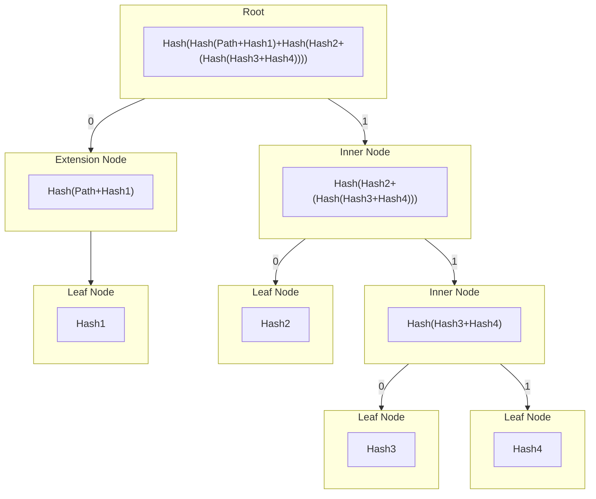

# smt

A Go library that implements a Sparse Merkle tree for a key-value map. The tree implements the same optimisations specified in the [Libra whitepaper][libra whitepaper], to reduce the number of hash operations required per tree operation to O(k) where k is the number of non-empty elements in the tree.

[](https://img.shields.io/github/v/tag/pokt-network/smt.svg?sort=semver)
[](https://github.com/pokt-network/smt/actions/workflows/test.yml)
[](https://codecov.io/gh/pokt-network/smt)
[](https://godoc.org/github.com/pokt-network/smt)

## Intro

Sparse Merkle Trees (SMTs) are efficient and secure data structures for storing key-value pairs. They use a hash-based tree structure to represent the data sparsely, saving memory. Cryptographic hash functions ensure data integrity and authenticity. SMTs enable users to prove the existence or non-existence of specific key-value pairs by constructing cryptographic proofs. These properties make SMTs valuable in applications like blockchains, decentralized databases, and authenticated data structures, providing optimized and trustworthy data storage and verification.

## Implementation

The SMT has 4 node types that are used to construct the tree:

- Inner Nodes
- Extension Nodes
- Leaf Nodes
- Lazy Nodes

### Inner Nodes

Inner nodes represent a branch in the tree with two **non-nil** child nodes. The inner node has an internal `digest` which represents the hash of the child nodes concatenated hashes.

### Extension Nodes

Extension nodes represent a singly linked chain of inner nodes, with a single child. They are used to represent a common path in the tree and as such contain the path and bounds of the path they represent. The `digest` of an extension node is the hash of its path bounds, the path itself and the child nodes digest concatenated.

### Leaf Nodes

Leaf nodes store the full path which they represent and also the hash of the value they store. The `digest` of a leaf node is the hash of the leaf nodes path and value concatenated.

The SMT stores only the hashes of the values in the tree, not the raw values themselves. In order to store the raw values in the underlying database the option `WithValueHasher(nil)` must be passed into the `NewSparseMerkleTree` constructor.

### Lazy Nodes

Lazy nodes represent uncached, persisted nodes, and as such only store the `digest` of the node. When a lazy node is accessed the node type will be determined and the full node type will be populated with any relevant fields such as its children and path.

### Lazy Loading

This library uses a cached, lazy-loaded tree structure to optimize performance. It optimises performance by not reading from/writing to the underlying database on each operation, deferring any underlying changes until the `Commit()` function is called.

All nodes have a `persisted` field which signals whether they have been persisted to the underlying database or not. In practice this gives a large performance optimisation by working on cached data and not reading from/writing to the database on each operation. If a node is deleted from the tree it is marked as `orphaned` and will be deleted from the database when the `Commit()` function is called.

Once the `Commit()` function is called the tree will delete any orphaned nodes from the database and write the key-value pairs of all the unpersisted leaf nodes' hashes and their values to the database.

### Visualisation

The following diagram shows a simplified version of how the tree can be visualised using the node types described above.



## Database

This library defines the `MapStore` interface, in [mapstore.go](./mapstore.go)

```go
type MapStore interface {
	Get(key []byte) ([]byte, error)
	Set(key []byte, value []byte) error
	Delete(key []byte) error
}
```

This interface abstracts the `SimpleMap` key-value store and can be used by the SMT to store the nodes of the tree. Any key-value store that implements the `MapStore` interface can be used with this library.

## Example

```go
package main

import (
	"crypto/sha256"
	"fmt"

	"github.com/pokt-network/smt"
)

func main() {
	// Initialise a new key-value store to store the nodes of the tree
	// (Note: the tree only stores hashed values, not raw value data)
	nodeStore := smt.NewSimpleMap()

	// Initialise the tree
	tree := smt.NewSparseMerkleTree(nodeStore, sha256.New())

	// Update the key "foo" with the value "bar"
	_ = tree.Update([]byte("foo"), []byte("bar"))

	// Generate a Merkle proof for "foo"
	proof, _ := tree.Prove([]byte("foo"))
	root := tree.Root() // We also need the current tree root for the proof

	// Verify the Merkle proof for "foo"="bar"
	if smt.VerifyProof(proof, root, []byte("foo"), []byte("bar"), tree.Spec()) {
		fmt.Println("Proof verification succeeded.")
	} else {
		fmt.Println("Proof verification failed.")
	}
}
```

[libra whitepaper]: https://diem-developers-components.netlify.app/papers/the-diem-blockchain/2020-05-26.pdf
