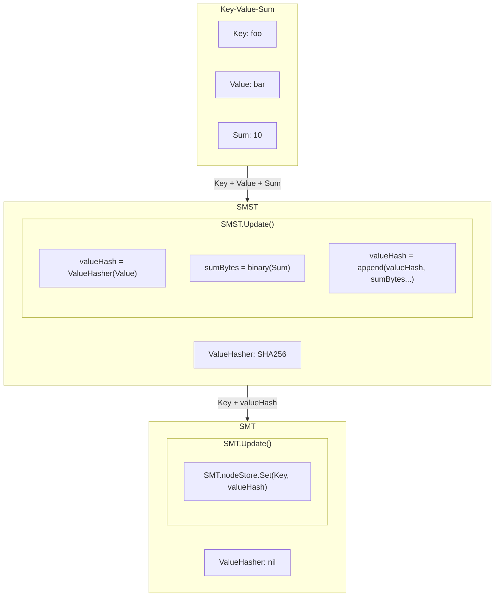
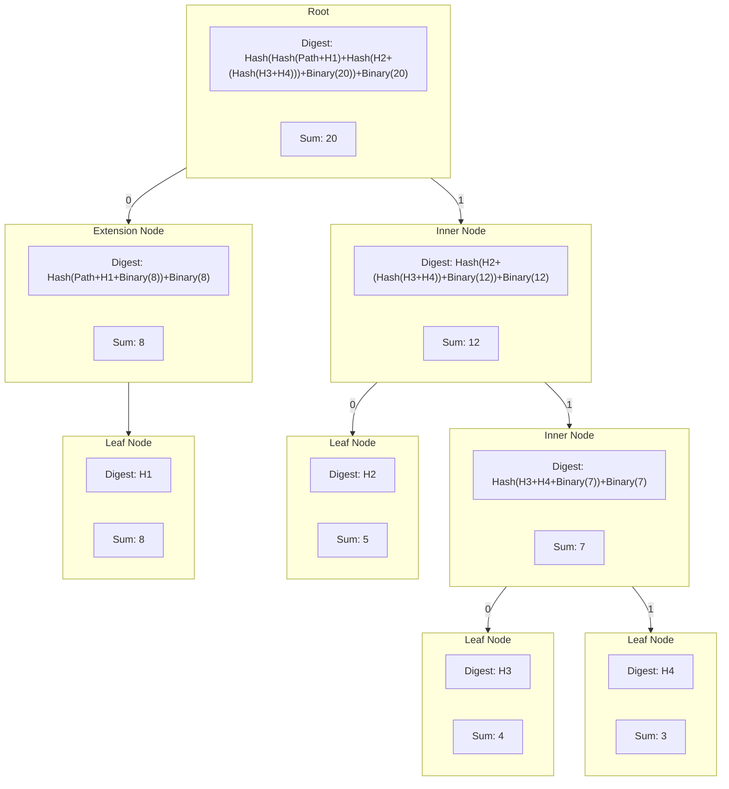
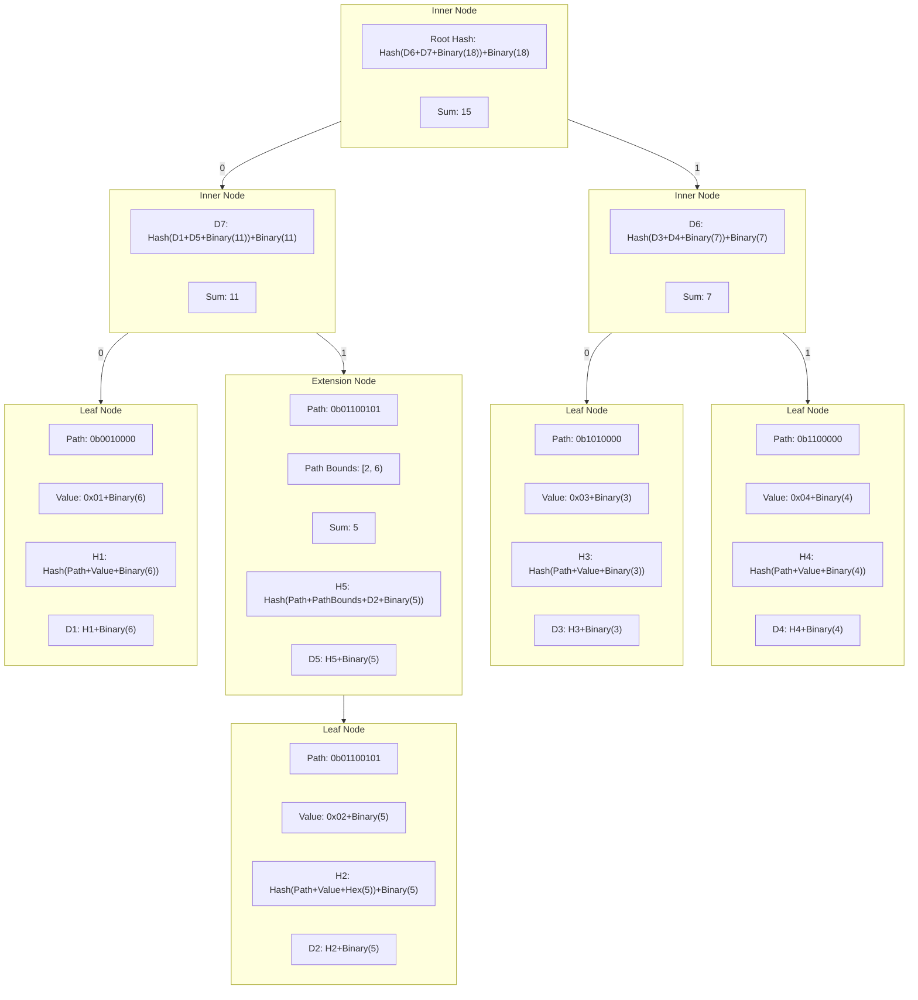

# Sparse Merkle Sum Trie (smst)

<!-- toc -->

- [Sparse Merkle Sum Trie (smst)](#sparse-merkle-sum-trie-smst)
  - [Overview](#overview)
  - [Implementation](#implementation)
    - [Sum Encoding](#sum-encoding)
    - [Digests](#digests)
    - [Visualisations](#visualisations)
      - [General Trie Structure](#general-trie-structure)
      - [Binary Sum Digests](#binary-sum-digests)
  - [Sum](#sum)
  - [Roots](#roots)
  - [Nil Values](#nil-values)

<!-- tocstop -->

## Overview

Merkle Sum tries function very similarly to regular Merkle tries, with the
primary difference being that each leaf node in a Merkle sum trie includes a
`sum` in addition to its value. This allows for the entire trie's total sum to
be calculated easily, as the sum of any branch is the sum of its children. Thus
the sum of the root node is the sum of the entire trie. Like a normal Merkle
trie, the Merkle sum trie allows for the efficient verification of its members,
proving inclusion/exclusion of certain elements and generally functions the same.

Merkle sum tries can be very useful for blockchain applications in that they can
easily track accounts balances and, thus, the total balance of all accounts.
They can be very useful in proof of reserve systems whereby one needs to prove
the inclusion of an element that is a component of the total sum, along with a
verifiable total sum of all elements.

## Implementation

The implementation of the Sparse Merkle Sum Trie (SMST) follows, in principle,
the same implementation as the [Plasma Core Merkle Sum Tree][plasma core docs].
The main differences with the current SMT implementation are outlined below.
The primary difference lies in the encoding of node data within the trie to
accommodate for the sum.

_NOTE: The Plasma Core Merkle Sum trie uses a 16 byte hex string to encode the
sum whereas this SMST implementation uses an 8 byte binary representation of the
`uint64` sum._

In practice the SMST is a wrapper around the SMT with a new field added to the
`TrieSpec`: `sumTrie bool` this determines whether the SMT should follow its
regular encoding of that of the sum trie.

See: the [SMT documentation](./smt.md) for the details on how the SMT works.

The majority of the code relating to the SMST can be found in:

- [smst.go](../smst.go) - main SMT wrapper functionality
- [hasher.go](../hasher.go) - SMST encoding functions
- [types.go](../types.go) - SMST interfaces and node serialisation/hashing
  functions

### Sum Encoding

The sum for any node is encoded in a byte array with a fixed size (`[8]byte`)
this allows for the sum to fully represent a `uint64` value in binary form.
The golang `encoding/binary` package is used to encode the sum with
`binary.BigEndian.PutUint64(sumBz[:], sum)` into a byte array `sumBz`.

In order for the SMST to include the sum into a leaf node the SMT the SMST
initialises the SMT with the `WithValueHasher(nil)` option so that the SMT does
**not** hash any values. The SMST will then hash the value and append the sum
bytes to the end of the hashed value, using whatever `ValueHasher` was given to
the SMST on initialisation.

### Digests

The digest for any node in the SMST is calculated in partially the same manner
as the regular SMT. The main differences are that the sum is included in the
digest `preimage` - meaning the hash of any node's data includes **BOTH** its
data _and_ sum. In addition to this the sum is appended to the hash producing
digests like so:

`digest = [node hash]+[8 byte sum]`

Therefore for the following node types, the digests are computed as follows:

- **Inner Nodes**
  - Prefix: `[]byte{1}`
  - `sumBytes = binary(leftChild.sum+rightChild.sum)`
  - `digest = hash([]byte{1} + leftChild.digest + rightChild.digest + sumBytes) + sumBytes`
- **Extension Nodes**
  - Prefix: `[]byte{2}`
  - `sumBytes = binary(child.sum)`
  - `digest = hash([]byte{2} + pathBounds + path + child.digest + sumBytes) + sumBytes`
- **Leaf Nodes**
  - Prefix: `[]byte{0}`
  - `sumBytes = binary(sum)`
  - `digest = hash([]byte{0} + path + valueHash) + sumBytes`
    - **Note**: as mentioned above the `valueHash` is already appended with the
      `sumBytes` prior to insertion in the underlying SMT
- **Lazy Nodes**
  - Prefix of the actual node type is stored in the persisted digest as
    determined above
  - `digest = persistedDigest`

This means that with a hasher such as `sha256.New()` whose hash size is
`32 bytes`, the digest of any node will be `40 bytes` in length.

### Visualisations

The following diagrams are representations of how the trie and its components
can be visualised.

#### General Trie Structure

None of the nodes have a different structure to the regular SMT, but the digests
of nodes now include their sum as described above and the sum is included in the
leaf node's value. For the purposes of visualization, the sum is included in all
nodes as an extra field.

#### Binary Sum Digests

The following diagram shows the structure of the digests of the nodes within
the trie in a simplified manner, again none of the nodes have a `sum` field,
but for visualisation purposes the sum is included in all nodes with the
exception of the leaf nodes where the sum is shown as part of its value.

## Sum

The `Sum()` function adds functionality to easily retrieve the trie's current
sum as a `uint64`.

## Roots

The root of the tree is a slice of bytes. `MerkleRoot` is an alias for `[]byte`.
This design enables easily passing around the data (e.g. on-chain)
while maintaining primitive usage in different use cases (e.g. proofs).

`MerkleRoot` provides helpers, such as retrieving the `Sum() uint64` to
interface with data it captures.

## Nil Values

A `nil` value and `0` weight is the same as the placeholder value and default
sum in the SMST and as such inserting a key with a `nil` value has specific
behaviours. Although the insertion of a key-value-weight grouping with a `nil`
value and `0` weight will alter the root hash, a proof will not recognise the
key as being in the trie.

Assume `(key, value, weight)` groupings as follows:

- `(key, nil, 0)` -> DOES modify the `root` hash
  - Proving this `key` is in the trie will fail
- `(key, nil, weight)` -> DOES modify the `root` hash
  - Proving this `key` is in the trie will succeed
- `(key, value, 0)` -> DOES modify the `root` hash
  - Proving this `key` is in the trie will succeed
- `(key, value, weight)` -> DOES modify the `root` hash
  - Proving this `key` is in the trie will succeed
- `(key, value, weight)` -> DOES modify the `root` hash
  - Proving this `key` is in the trie will succeed

[plasma core docs]: https://plasma-core.readthedocs.io/en/latest/specs/sum-tree.html
