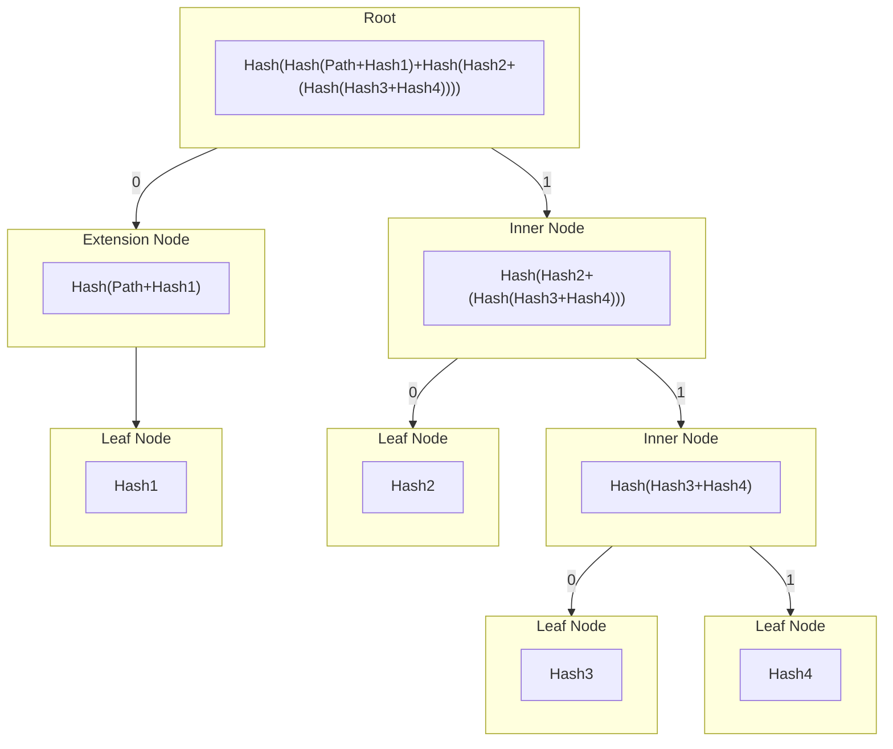
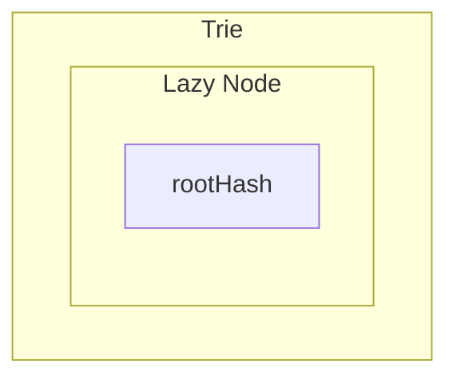
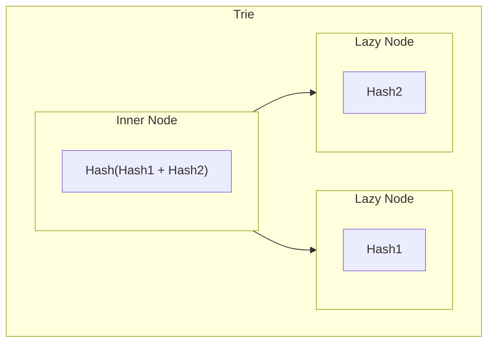
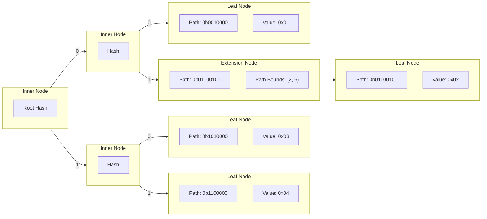
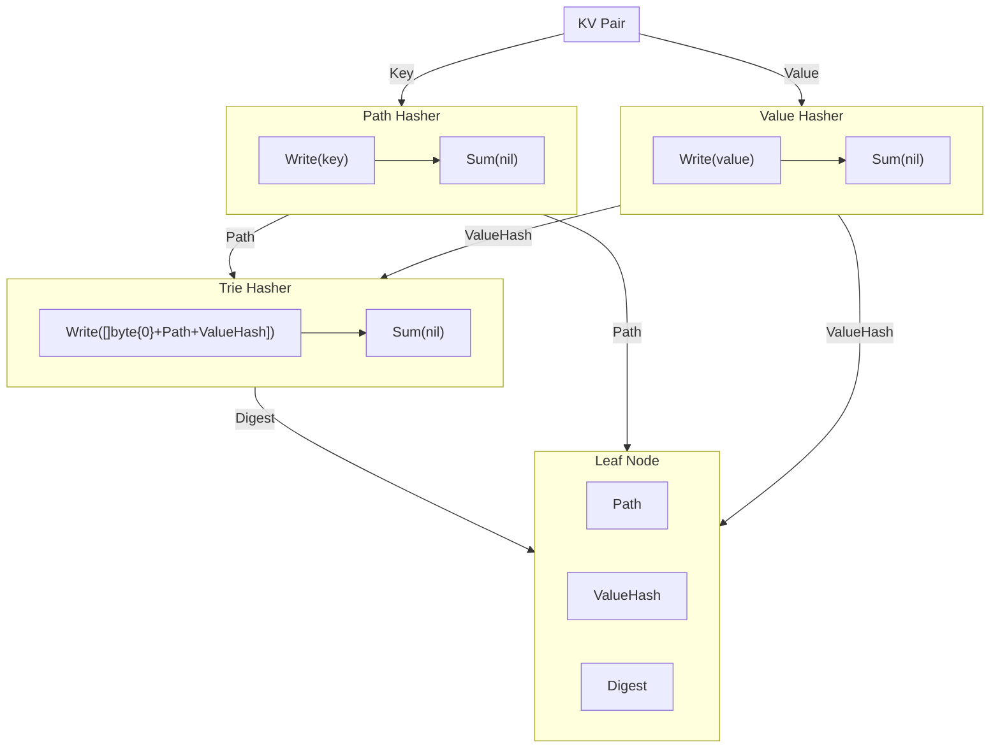

# smt

<!-- toc -->

- [Overview](#overview)
- [Implementation](#implementation)
  * [Inner Nodes](#inner-nodes)
  * [Extension Nodes](#extension-nodes)
  * [Leaf Nodes](#leaf-nodes)
  * [Lazy Nodes](#lazy-nodes)
  * [Lazy Loading](#lazy-loading)
  * [Visualisations](#visualisations)
    + [General Trie Structure](#general-trie-structure)
    + [Lazy Nodes](#lazy-nodes-1)
- [Paths](#paths)
  * [Visualisation](#visualisation)
- [Values](#values)
  * [Nil values](#nil-values)
- [Hashers & Digests](#hashers--digests)
- [Roots](#roots)
- [Proofs](#proofs)
  * [Verification](#verification)
  * [Closest Proof](#closest-proof)
    + [Closest Proof Use Cases](#closest-proof-use-cases)
  * [Compression](#compression)
  * [Serialisation](#serialisation)
- [Database](#database)
  * [Database Submodules](#database-submodules)
    + [SimpleMap](#simplemap)

<!-- tocstop -->

## Overview

Sparse Merkle Tries (SMTs) are efficient and secure data structures for storing
key-value pairs. They use a hash-based trie structure to represent the data
sparsely, saving memory. Cryptographic hash functions ensure data integrity and
authenticity. SMTs enable users to prove the existence or non-existence of
specific key-value pairs by constructing cryptographic proofs. These properties
make SMTs valuable in applications like blockchains, decentralized databases,
and authenticated data structures, providing optimized and trustworthy data
storage and verification.

See [smt.go](../smt.go) for more details on the implementation.

## Implementation

The SMT has 4 node types that are used to construct the trie:

- Inner Nodes
  - Prefixed `[]byte{1}`
  - `digest = hash([]byte{1} + leftChild.digest + rightChild.digest)`
- Extension Nodes
  - Prefixed `[]byte{2}`
  - `digest = hash([]byte{2} + pathBounds + path + child.digest)`
- Leaf Nodes
  - Prefixed `[]byte{0}`
  - `digest = hash([]byte{0} + path + value)`
- Lazy Nodes
  - Prefix of the actual node type is stored in the persisted digest as
    determined above
  - `digest = persistedDigest`

### Inner Nodes

Inner nodes represent a branch in the trie with two **non-nil** child nodes.
The inner node has an internal `digest` which represents the hash of the child
nodes concatenated hashes.

### Extension Nodes

Extension nodes represent a singly linked chain of inner nodes, with a single
child. They are used to represent a common path in the trie and as such contain
the path and bounds of the path they represent. The `digest` of an extension
node is the hash of its path bounds, the path itself and the child nodes digest
concatenated.

### Leaf Nodes

Leaf nodes store the full path which they represent and also the hash of the
value they store. The `digest` of a leaf node is the hash of the leaf nodes path
and value concatenated.

The SMT stores only the hashes of the values in the trie, not the raw values
themselves. In order to store the raw values in the underlying database the
option `WithValueHasher(nil)` must be passed into the `NewSparseMerkleTrie`
constructor.

### Lazy Nodes

Lazy nodes represent uncached, persisted nodes, and as such only store the
`digest` of the node. When a lazy node is accessed the node type will be
determined and the full node type will be populated with any relevant fields
such as its children and path.

### Lazy Loading

This library uses a cached, lazy-loaded trie structure to optimize performance.
It optimises performance by not reading from/writing to the underlying database
on each operation, deferring any underlying changes until the `Commit()`
function is called.

All nodes have a `persisted` field which signals whether they have been
persisted to the underlying database or not. In practice this gives a large
performance optimisation by working on cached data and not reading from/writing
to the database on each operation. If a node is deleted from the trie it is
marked as `orphaned` and will be deleted from the database when the `Commit()`
function is called.

Once the `Commit()` function is called the trie will delete any orphaned nodes
from the database and write the key-value pairs of all the unpersisted leaf
nodes' hashes and their values to the database.

### Visualisations

The following diagrams are representations of how the trie and its components
can be visualised.

#### General Trie Structure

The different nodes types described above make the trie have a structure similar
to the following:

#### Lazy Nodes

When importing a trie via `ImportSparseMerkleTrie` the trie will be lazily
loaded from the root hash provided. As such the initial trie structure would
contain just a single lazy node, until the trie is used and nodes have to be
resolved from the database, whose digest is the root hash of the trie.

If we were to resolve just this root node, we could have the following trie
structure:

Where `Hash(Hash1 + Hash2)` is the same root hash as the previous example.

## Paths

Paths are **only** stored in two types of nodes: Leaf nodes and Extension nodes.

- Extension nodes contain not only the path they represent but also the path
  bounds (ie. the start and end of the path they cover).
- Leaf nodes contain the full path which they represent, as well as the value
  stored at that path.

Inner nodes do **not** contain a path, as they represent a branch in the trie
and not a path. As such their children, _if they are extension nodes or leaf
nodes_, will hold a path value.

### Visualisation

The following diagram shows how paths are stored in the different nodes of the
trie. In the actual SMT paths are not 8 bit binary strings but are instead the
returned values of the `PathHasher` (discussed below). These are then used to
calculate the path bit (`0` or `1`) at any index of the path byte slice.

## Values

By default the SMT will use the `hasher` passed into `NewSparseMerkleTrie` to
hash both the keys into their paths in the trie, as well as the values. This
means the data stored in a leaf node will be the hash of the value, not the
value itself.

However, if this is not desired, the two option functions `WithPathHasher` and
`WithValueHasher` can be used to change the hashing function used for the keys
and values respectively.

If `nil` is passed into `WithValueHasher` functions, it will act as identity
hasher and store the values unaltered in the trie.

### Nil values

A `nil` value is the same as the placeholder value in the SMT and as such
inserting a key with a `nil` value has specific behaviours. Although the
insertion of a key-value pair with a `nil` value will alter the root hash, a
proof will not recognise the key as being in the trie.

Assume `(key, value)` pairs as follows:

- `(key, nil)` -> DOES modify the `root` hash
  - Proving this `key` is in the trie will fail
- `(key, value)` -> DOES modify the `root` hash
  - Proving this `key` is in the trie will succeed

## Hashers & Digests

When creating a new SMT or importing one a `hasher` is provided, typically this
would be `sha256.New()` but could be any hasher implementing the go `hash.Hash`
interface. By default this hasher, referred to as the `TrieHasher` will be used
on both keys (to create paths) and values (to store). But separate hashers can
be passed in via the option functions mentioned above.

Whenever we do an operation on the trie, the `PathHasher` is used to hash the
key and return its digest - the path. When we store a value in a leaf node we
hash it using the `ValueHasher`. These digests are calculated by writing to the
hasher and then calculating the checksum by calling `Sum(nil)`.

The digests of all nodes, regardless of the `PathHasher` and `ValueHasher`s
being used, will be the result of writing to the `TrieHasher` and calculating
the `Sum`. The exact data hashed will depend on the type of node, this is
described in the [implementation](#implementation) section.

The following diagram represents the creation of a leaf node in an abstracted
and simplified manner.

_Note: This diagram is not entirely accurate regarding the process of creating
a leaf node, but is a good representation of the process._

## Roots

The root of the tree is a slice of bytes. `MerkleRoot` is an alias for `[]byte`.
This design enables easily passing around the data (e.g. on-chain)
while maintaining primitive usage in different use cases (e.g. proofs).

`MerkleRoot` provides helpers, such as retrieving the `Sum(sumTrie bool)uint64`
to interface with data it captures. However, for the SMT it **always** panics,
as there is no sum.

## Proofs

The `SparseMerkleProof` type contains the information required for inclusion
and exclusion proofs, depending on the key provided to the trie method
`Prove(key []byte)` either an inclusion or exclusion proof will be generated.

_NOTE: The inclusion and exclusion proof are the same type, just constructed
differently_

The `SparseMerkleProof` type contains the relevant information required to
rebuild the root hash of the trie from the given key. This information is:

- Any side nodes
- Data of the sibling node
- Data for the unrelated leaf at the path
  - This is `nil` for inclusion proofs, and only used for exclusion proofs

### Verification

In order to verify a `SparseMerkleProof` the `VerifyProof` method is called with
the proof, trie spec, root hash as well as the key and value that the proof is
for. When verifying an exclusion proof the value provided should be `nil`.

The verification step simply uses the proof data to recompute the root hash with
the data provided and the digests stored in the proof. If the root hash matches
the one provided then the proof is valid, otherwise it is an invalid proof.

### Closest Proof

The `SparseMerkleClosestProof` is a novel proof mechanism, which can provide a
proof of inclusion for a sentinel leaf in the trie with the most bits in common
with the hash provided to the `ProveClosest()` method. This works by traversing
the trie according to the path of the hash provided and if encountering a `nil`
node then backstepping and flipping the path bit for that depth in the path.

This backstepping process allows the traversal to continue until it reaches a
sentinel leaf that has the longest common prefix and most bits in common with
the provided hash, up to the depth of the leaf found.

This method guarantees a proof of inclusion in all cases and can be verified by
using the `VerifyClosestProof` function which requires the proof and root hash
of the trie.

Since the `ClosestProof` method takes a hash as input, it is possible to place a
leaf in the trie according to the hash's path, if it is known. Depending on
the use case of this function this may expose a vulnerability. **It is not
intendend to be used as a general purpose proof mechanism**, but instead as a
**Commit and Reveal** mechanism, as detailed below.

#### Closest Proof Use Cases

The `CloestProof` function is intended for use as a `commit & reveal` mechanism.
Where there are two actors involved, the **prover** and **verifier**.

_NOTE: Throughout this document, `commitment` of the the trie's root hash is also
referred to as closing the trie, such that no more updates are made to it once
committed._

Consider the following attack vector (**without** a commit prior to a reveal)
into consideration:

1. The **verifier** picks the hash (i.e. a single branch) they intend to check
1. The **prover** inserts a leaf (i.e. a value) whose key (determined via the
   hasher) has a longer common prefix than any other leaf in the trie.
1. Due to the deterministic nature of the `ClosestProof`, method this leaf will
   **always** be returned given the identified hash.
1. The **verifier** then verifies the revealed `ClosestProof`, which returns a
   branch the **prover** inserted after knowing which leaf was going to be
   checked.

Consider the following normal flow (**with** a commit prior to reveal) as

1. The **prover** commits to the state of their trie by publishes their root
   hash, thereby _closing_ their trie and not being able to make further
   changes.
1. The **verifier** selects a hash to be used in the `commit & reveal` process
   that the **prover** must provide a closest proof for.
1. The **prover** utilises this hash and computes the `ClosestProof` on their
   _closed_ trie, producing a `ClosestProof`, thus revealing a deterministic,
   pseudo-random leaf that existed in the tree prior to commitment, yet
1. The **verifier** verifies the proof, in turn, verifying the commitment
   made by the **prover** to the state of the trie in the first step.
1. The **prover** had no opportunity to insert a new leaf into the trie
   after learning which hash the **verifier** was going to require a
   `ClosestProof` for.

### Compression

Both proof types have compression and decompression functions available to
reduce their size, for more efficient storage. These can be created by calling:

- `CompactProof(SparseMerkleProof)` to produce a `SparseCompactMerkleProof`
- `CompactClosestProof(SparseMerkleClosestProof)` to produce a
  `SparseCompactMerkleClosestProof`

These compacted proof types can then be decompressed by calling:

- `DecompactProof(SparseCompactMerkleProof)` to produce the corresponding
  `SparseMerkleProof`
- `DecompactClosestProof(SparseCompactMerkleClosestProof)` to produce the
  corresponding `SparseMerkleClosestProof`

### Serialisation

All proof types are serialisable in both their regular and compressed forms.
This is done through the `encoding/gob` package that provides optimisations
around marshalling and unmarshalling custom go types compared to other encoding
schemes.

## Database

By default, this library provides a simple interface (`MapStore`) which can be
found in [`kvstore/interfaces.go`](../kvstore/interfaces.go) and submodule
implementations of said interface. These submodules allow for more extensible
key-value store implementations that give the user more control over their
database backing the underlying trie.

### Database Submodules

In addition to providing the `MapStore` interface and `simplemap`
implementation, the `smt` library also provides wrappers around other key-value
databases as submodules with more fully-featured interfaces that can be used
outside of backing key-value engines for tries. These submodules can be found in
the [`kvstore`](../kvstore/) directory.

#### SimpleMap

This l
